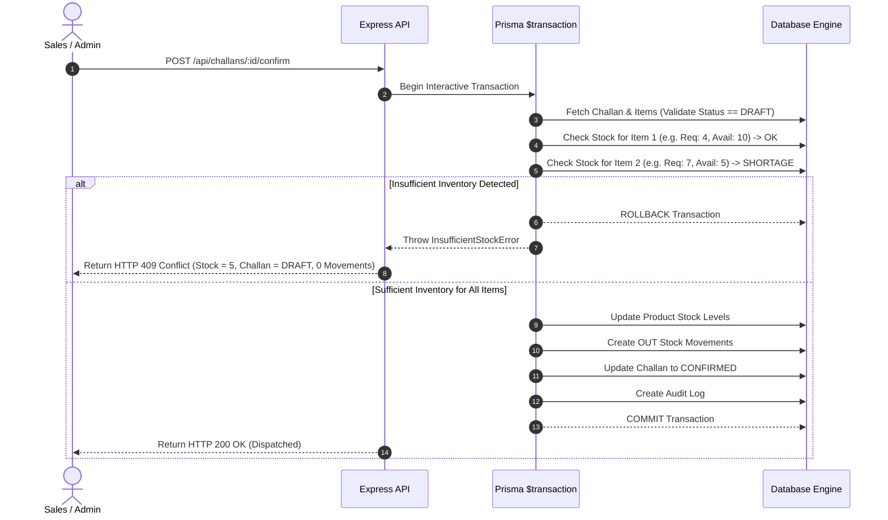

# VANTA ERP — Business Workflows & Transaction Lifecycles

## 1. Wholesale Operations Lifecycle

```
[1. CRM & Lead Discovery]
  Sales representative registers Wholesale / Distributor client with GSTIN & Address.
       │
       ▼
[2. CRM Follow-Up Management]
  Sales team logs notes and schedules next contact dates (non-destructive audit history).
       │
       ▼
[3. Multi-Item Sales Challan Creation]
  Sales user drafts delivery voucher with real-time warehouse stock indicators.
       │
       ▼
[4. Transactional Confirmation & Stock Deduction]
  Sales / Admin confirms challan:
  - Database locks product rows in interactive transaction.
  - Verifies currentStock >= quantity for EVERY item.
  - Deducts inventory and logs OUT stock movements.
  - Transitions Challan from DRAFT -> CONFIRMED.
       │
       ▼
[5. Tax Invoicing & Billing]
  Accounts team generates GST tax invoice bound to confirmed delivery challan.
       │
       ▼
[6. Executive Reporting]
  Live stock asset valuation and sales performance dashboards update instantly.
```

---

## 2. Transactional Stock Safety & Rollback Flow



---

## 3. Cancellation & Reversal Business Rules

1. **Draft Challan Cancellation**: Transitions state from `DRAFT` $\rightarrow$ `CANCELLED`. Zero inventory adjustments are made.
2. **Confirmed Challan Cancellation**: Transitions state from `CONFIRMED` $\rightarrow$ `CANCELLED`. Transactionally restores previously deducted stock and creates reversing `IN` stock movement ledger entries.
3. **Immutable State Protection**: Once an invoice is generated or a challan is cancelled, invalid transitions (e.g. `CANCELLED` $\rightarrow$ `CONFIRMED`) are rejected with `HTTP 409 Conflict`.
