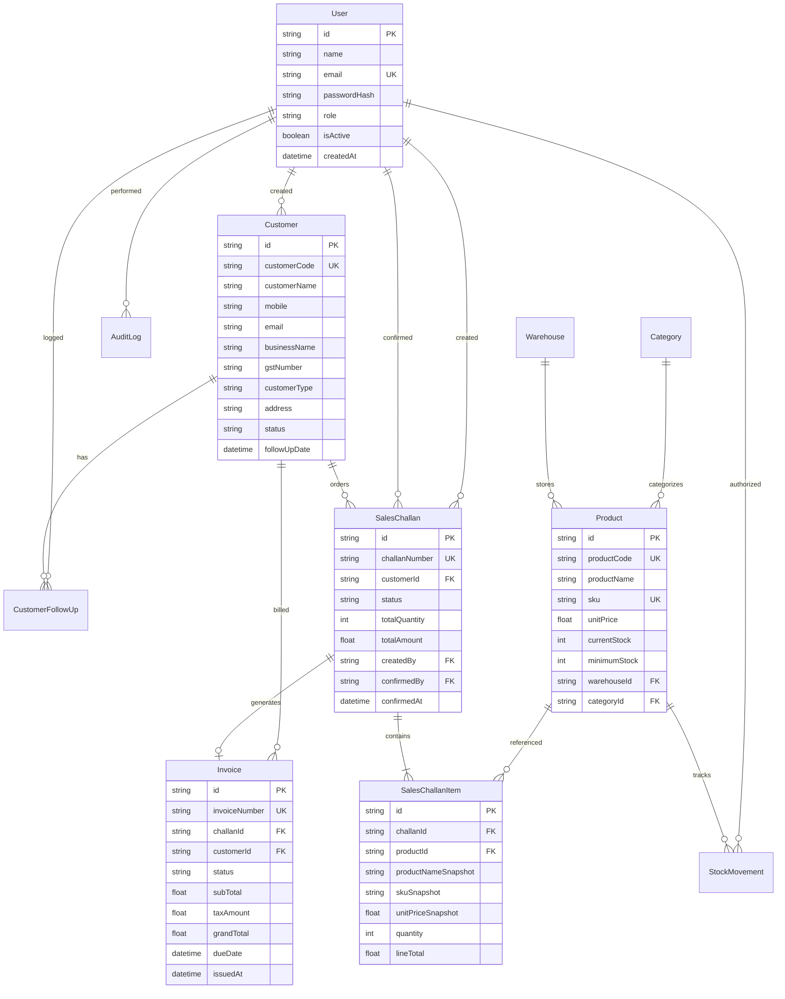

# VANTA ERP — Database Schema & Data Integrity Design

## 1. Relational Entity Relationship Diagram (ERD)

---

## 2. Entity Specifications & Field Indexes

### 1. User
- **Indexes**: `email` (Unique), `role`.
- **RBAC Roles**: `ADMIN`, `SALES`, `WAREHOUSE`, `ACCOUNTS`.

### 2. Customer
- **Indexes**: `customerCode` (Unique), `customerName`, `mobile`, `email`, `status`, `customerType`.
- **Types**: `RETAIL`, `WHOLESALE`, `DISTRIBUTOR`.
- **Statuses**: `LEAD`, `ACTIVE`, `INACTIVE`.

### 3. Product
- **Indexes**: `sku` (Unique), `productCode` (Unique), `productName`, `categoryId`, `currentStock`.
- **Integrity**: `currentStock >= 0` enforced by transactional service guards and SQLite/PostgreSQL check constraints.

### 4. StockMovement
- **Indexes**: `productId`, `movementType`, `createdAt`, `referenceId`.
- **Types**: `IN` (Goods Receipt, Audit Add), `OUT` (Sales Challan Delivery, Adjustment).

### 5. SalesChallan & SalesChallanItem
- **Indexes**: `challanNumber` (Unique), `customerId`, `status`, `createdAt`.
- **Snapshot Pattern**: Line items store `productNameSnapshot`, `skuSnapshot`, and `unitPriceSnapshot` immutably.

### 6. Invoice
- **Indexes**: `invoiceNumber` (Unique), `challanId` (Unique), `customerId`, `status`, `issuedAt`.
- **Statuses**: `ISSUED`, `PAID`, `CANCELLED`.
- **Integrity**: Directly derived from confirmed challans, preventing billing discrepancies.
